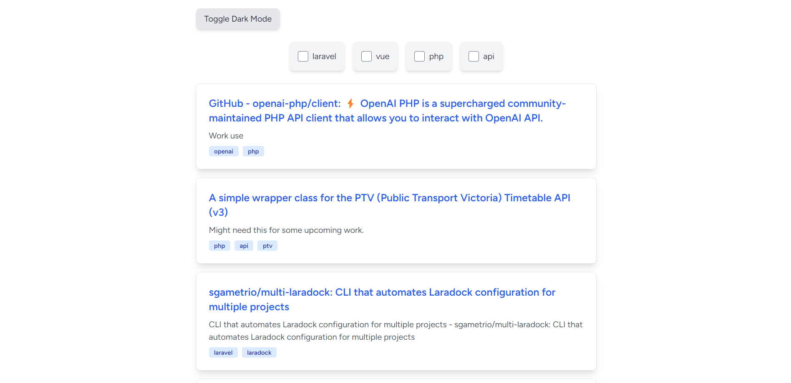
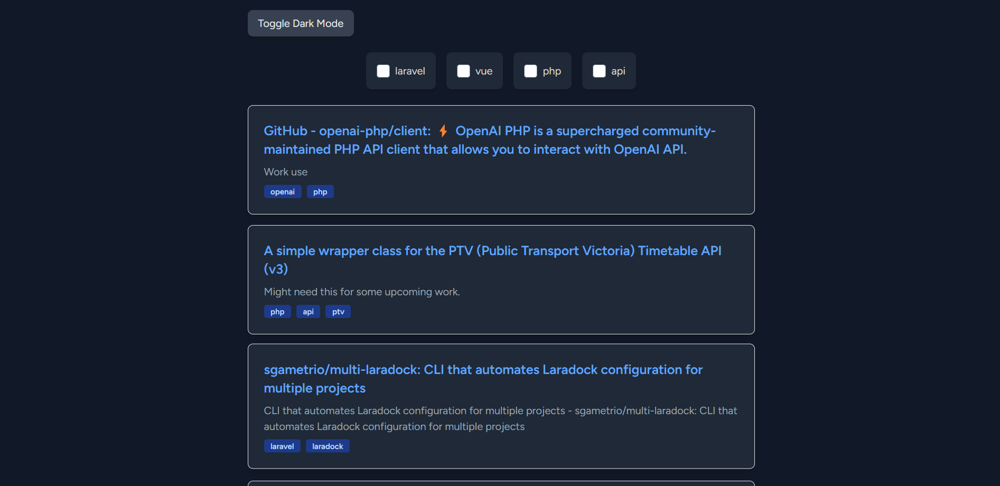
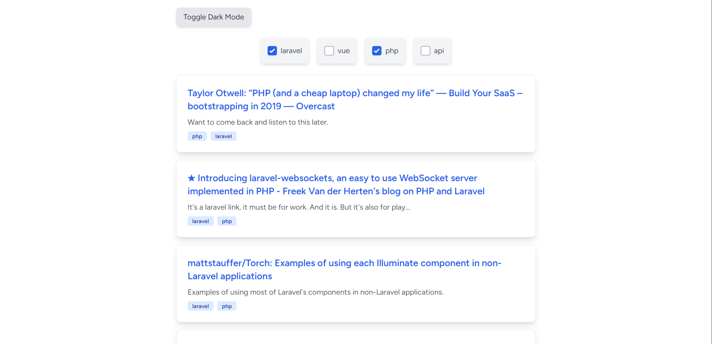
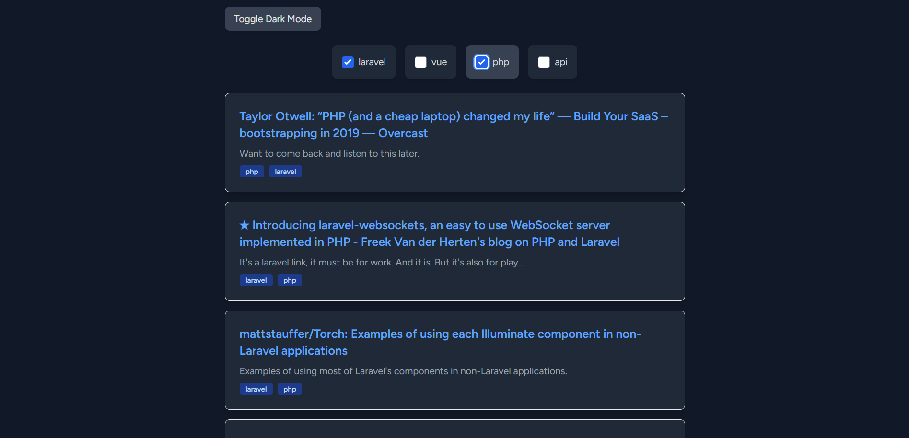
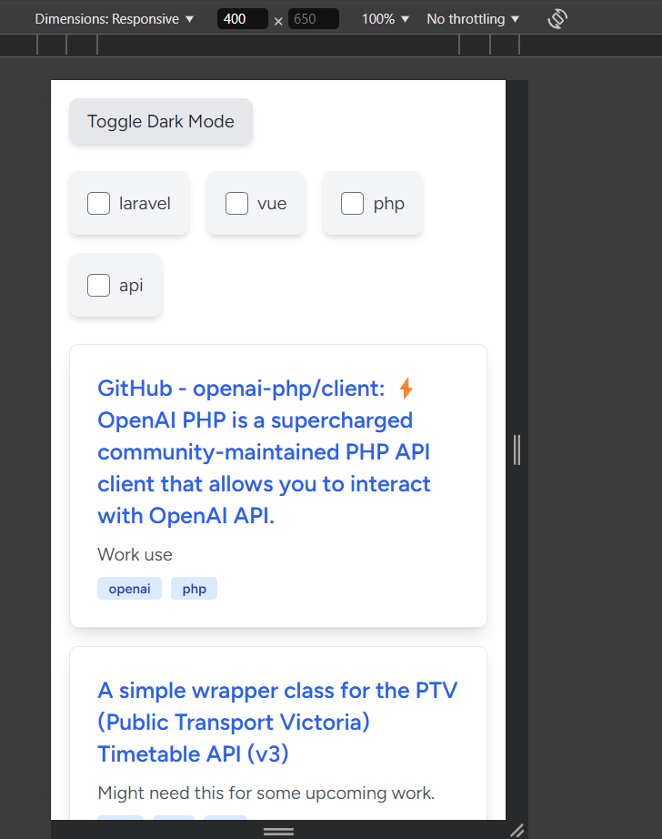
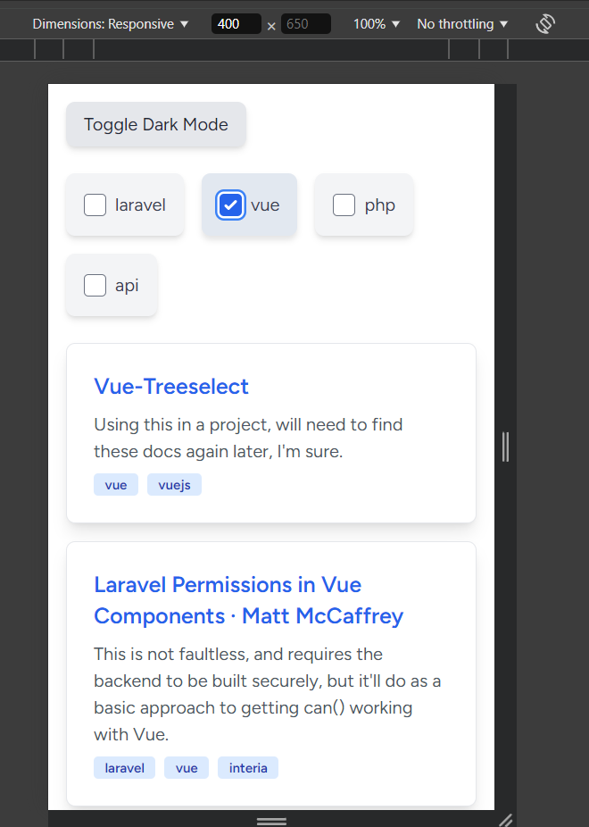

# Pinboard Links Project

## Overview

This project is a Laravel application that fetches and processes links from Pinboard, and presents them using a Vue.js front-end. The application includes a command to fetch links, an API route to return the data in JSON format, and a front-end interface to display the data with a dark/light mode switch.

## Brief

For more details about the project requirements, please refer to the [BRIEF.md](./BRIEF.md) file.

## Installation

1. **Clone the repository**:
   ```bash
   git clone https://github.com/Timmsy1998/pinboard-app.git
   cd pinboard-app
   ```

2. **Install PHP Dependencies**:
    ```bash
    composer install
    ```

3. **Install JavaScript Dependencies**:
    ```bash
    npm install
    ```

4. **Setup the Environment Variables**:  
    Copy the `.env.example` file to `.env` and update the relevant configuration settings

5. **Run Database Migrations**:
    ```bash
    php artisan migrate
    ```

6. **Generate the Application Key**:
    ```bash
    php artisan key:generate
    ```

7. **Fetch the Links**:
    ```bash
    php artisan app:fetch-links
    ```

## Running the Application Locally

1. **Start the PHP Server**:
    ```bash
    cd pinboard-app (if you haven't already)
    php artisan serve
    ```

2. **Compile the Frontend Assets**:
    ```bash
    npm run dev
    ```

3. **Navigate to the local environment**:
    The local environment should be accessible at either http://127.0.0.1:8000/ or http://localhost:8000/  
      
    The frontend for this application is viewable at http://127.0.0.1:8000/links or http://localhost:8000/links 

## Dependencies

- Laravel 11  
- - PHP 8.3  
- Vue.js 3  
- - Axios  
- Tailwind CSS  

## App Previews

<p align="center">
  
  
</p>
<p align="center">
  
  
</p>
<p align="center">
  
  
</p>

## Summary

Task Completion time was 2 hours and 32 minutes  
Unit Testing Completion Time was 35 minutes  
Total Time Spent was 3 hours and 07 minutes
  
### Approach and Reasoning

1. **Avoiding External Packages**:  
    - **Reason**: I aimed to showcase my knowledge of the built-in features and capabilities of Laravel, Vue, and Inertia. By avoiding external packages, I demonstrated my ability to leverage the core functionalities of these frameworks effectively.  
    - **Benefit**: This approach ensures that the application remains lightweight and avoids potential compatibility issues with third-party packages.  

2. **Choosing Inertia & Breeze**:  
    - **Reason**: Inertia and Breeze provide a quick and easy setup for integrating Laravel with Vue. Inertia allows for a seamless single-page application (SPA) experience without the need for a traditional API, while Breeze offers a simple and elegant authentication scaffolding should this be needed in future expansion.  
    - **Benefit**: This choice allowed me to focus on the core functionality of the application without spending too much time on the initial setup. It also provided a clean and maintainable codebase.


### Conclusion

By following this approach, I was able to efficiently build and test the application using the core features of Laravel, Vue, and Inertia. This demonstrates my ability to make informed decisions and utilize the strengths of these frameworks to deliver a robust and maintainable application.
